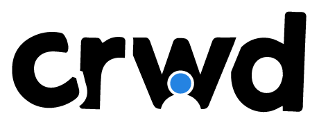

# CRWD Platform - Comming soon... 

CRWD is a platform for influencers and creators to connect with their audience and monetize their content. This is a closed community plaform. It allows users to create and join communities, share posts and comments, and participate in events and courses. CRWD is designed to be a safe and inclusive space where users can connect with others who share their interests, learn new skills, and build meaningful relationships b/w infuencer and his/her audience. And have deeper connection with their audience and monetize their content.

This is closed community platform, where users can join only by invitation or by request. The content is not public and can be accessed only by registered users and by users who have access to the community.The conteent are bespoken from the influencer or creator who is the owner of the community. The owner can create and manage the community and can invite users to join the community. The owner can also create and manage the posts, comments, events, courses, and other content in the community. The owner can also monetize the content by charging users for access to the community or for specific content within the community.

User can join the community by invitation or by request. User can also deeper connection with the influencer or creator by participating in events and courses, and by sharing posts and comments. User can also build meaningful relationships with other users who share their interests, and can learn new skills and gain new knowledge by participating in events and courses.

This platform will be one stop shop for influencers and creators to connect with their audience and monetize their content. It will allow influences to create content using GenAI tools to make their content more engaging and interactive. 

CRWD fetures are:

- Create and join communities
- Share posts and comments
- Participate in events and courses
- Content creation using GenAI tools
- One stop shop for influencers and creators
- Monetize content
- Build meaningful relationships
- Learn new skills
- Direct connection with influencer or creator
- Deeper connection with audience
- Gain new knowledge
- Secure and inclusive space
- Safe and user-friendly
- Clean and intuitive interface